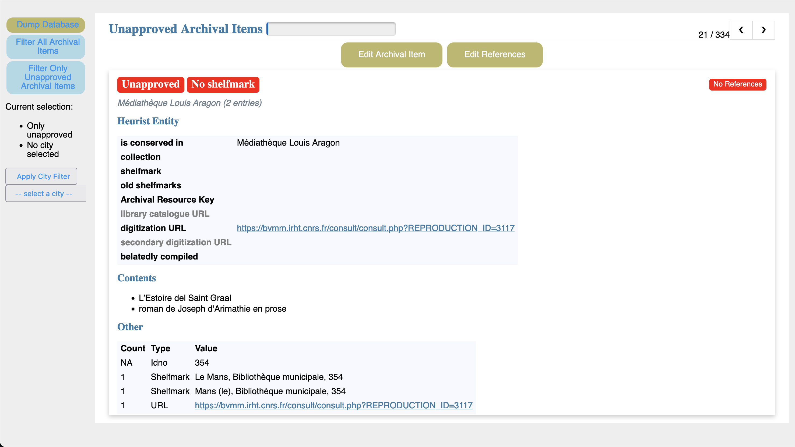
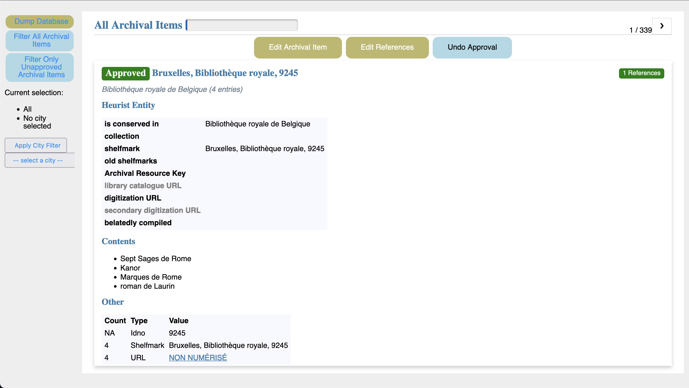

# EditManuscripts

Local web application for ergonomically editing bibliographic details about manuscripts (Archival Items) in the database.

```shell
flask --app app run
```

Edit details about an Archival Item and add/delete bibliographic references from external databases, i.e. Biblissima.




## Set up

1. Git clone this repository.

```shell
git clone git@github.com:LostMa-ERC/EditManuscripts.git
```
```shell
cd EditManuscripts
```

2. In a virtual Python environment (v. 3.12), install the requirements.

```shell
pip install -r requirements.txt
```

3. Initialize the database.

    - If you're starting from scratch, (a) load the CSV data you need in the [`./data`](data/) folder and (b) use the SQL script in [`schema-from-data.sql`](app/schema-from-data.sql).

    ```shell
    flask --app app init-db-scratch
    ```

    - You can re-initiate the database from a version that you dumped from within the web application, which is initially saved to the instance of the web application's `./instance folder`.

    ```shell
    flask --app app init-db
    ```

4. Run the web application and start editing.

```shell
flask --app app run
```
