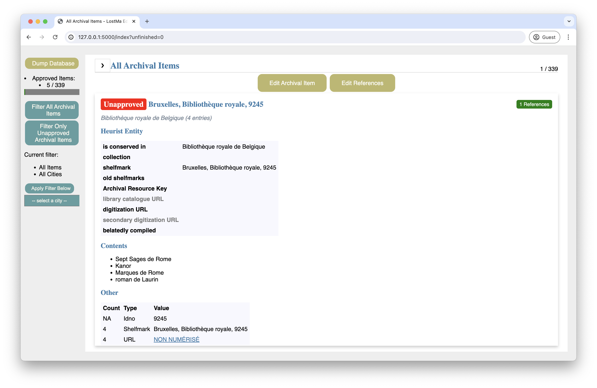

# EditManuscripts

Local web application for ergonomically editing bibliographic details about manuscripts (Archival Items) in the database.

```shell
flask --app app run
```

Edit details about an Archival Item and add/delete bibliographic references from external databases, i.e. Biblissima.



### Scrolling

Navigate the corpus of manuscripts that need manual editing.

- Flip through the manuscripts one by one using the buttons at the top left of the screen.
- Filter the corpus of manuscripts to see only what has not yet been approved and/or is stored in a certain city.

### Editing


After clicking `Edit Archival Item`, look at the Archival Item's details and, using those clues, find the right information and fill out the necessary data fields. Once you click `Approve` at the bottom of the form, you'll return to the previous page of the scroll and the Archival Item will now have a green `Approved` badge. Once an Archival Item has been reviewed and approved, it can be unapproved by clicking the blue button `Undo Approval`.


### Add references

Add references to the Archival Item from external databases, such as Jonas and Biblissima. Link the Archival Item to the reference's identifier and or permalink. The badge counting the number of references already added to an Archival Item updates instantly. Existing references can be deleted, which also updates the count.


## Set up

1. Git clone this repository.

    ```shell
    git clone git@github.com:LostMa-ERC/EditManuscripts.git
    ```

    ```shell
    cd EditManuscripts
    ```

2. In a virtual Python environment (v. 3.12), install the requirements.

    ```shell
    pip install -r requirements.txt
    ```

3. Initialize the database.

    - If you're starting from scratch, (a) load the CSV data you need in the [`./data`](data/) folder and (b) use the SQL script in [`schema-from-data.sql`](app/schema-from-data.sql).

    ```shell
    flask --app app init-db-scratch
    ```

    - You can re-initiate the database from a version that you dumped from within the web application, which is initially saved to the instance of the web application's `./instance folder`.

    ```shell
    flask --app app init-db
    ```

4. Run the web application and start editing.

    ```shell
    flask --app app run
    ```
